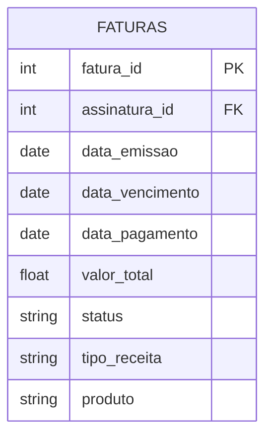
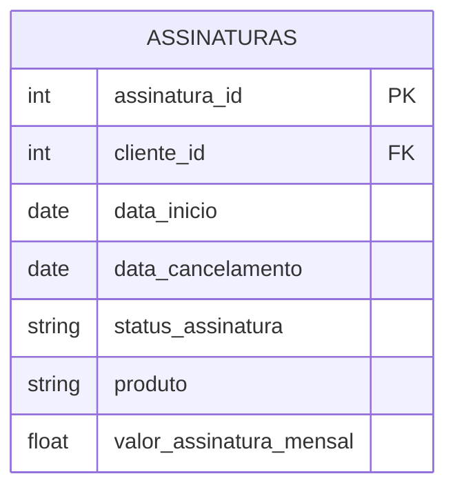
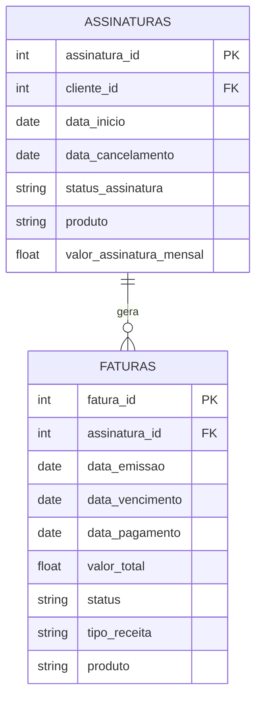

# Modelagem de tabealas

Para responder as perguntas listadas no enunciado ao menos duas tabelas seriam necessárias:

<b> 1 - Tabela faturas </b>
Tabela contendo informações sobre as faturas geradas, suas respectivas datas de emissão, de vencimento, de pagamento, valor total da fatura, status da fatura (aguardando_pagamento, pago, expirado, cancelada, etc), produto.




<b>2 - Tabela assinaturas</b>
Tabela contendo informações sobre as assinaturas dos clientes com suas respectivas datas de início, de cancelamento, valor da assinatura mensal, status da assinatura (ativa, cancelada, etc), produto associado.



<b>Relacionamento entre as tabelas:</b>



### Respondendo as perguntas com as tabelas

A seguir alguns exemplos de como responder as perguntas realizadas com as tabelas sugeridas:

<b> 1 - Quantos reais tivemos em Faturas geradas em julho/2022 que estão aguardando o pagamento?</b>

```sql
SELECT 
    SUM(valor_total) AS total_aguardando
FROM 
    faturas
WHERE 
    DATE_TRUNC(data_emissao, MONTH) = '2022-07-01'
    AND status = 'aguardando_pagamento'
```

total_aguardando
-----------------
1450.00


<b>2 - Quantos reais tivemos em Faturas expiradas em julho/2022?</b>

```sql
SELECT 
    SUM(valor_total) AS total_expirado
FROM 
    faturas
WHERE 
    DATE_TRUNC(data_vencimento, MONTH) = '2022-07-01'
    AND status = 'expirado';
```

<b> 3 - Quantos reais tivemos de Faturas pagas por mês de Assinaturas por produto?</b>

```sql
WITH base as (
    SELECT 
    DATE_TRUNC(data_pagamento, MONTH) AS mes,
    produto,
    SUM(valor_total) over (partition by DATE_TRUNC(data_pagamento, MONTH), produto) AS total_pago
FROM 
    faturas
WHERE 
    tipo_receita = 'assinatura'
    AND status = 'pago'
) SELECT * FROM base group by mes, produto, total_pago;
```

<b> 4 - Quanto tivemos de Receita mensal de Taxa de Implementação e Projetos?</b>

```sql
WITH base as (
    SELECT 
    DATE_TRUNC(data_pagamento, MONTH) AS mes,
    tipo_receita,
    SUM(valor_total) over (partition by DATE_TRUNC(data_pagamento, MONTH), tipo_receita) AS total_receita
FROM 
    faturas
WHERE 
    tipo_receita IN ('taxa_implementacao', 'projeto')
    AND status = 'pago'
) SELECT * FROM base GROUP BY mes, tipo_receita, total_receita
```

<b> 5 - Quantas Assinaturas canceladas temos por mês? </b>

```sql
SELECT 
    DATE_TRUNC(data_cancelamento, MONTH) AS mes,
    COUNT(*) AS total_canceladas
FROM 
    assinaturas
WHERE 
    status_assinatura = 'cancelada'
GROUP BY data_cancelamento

```