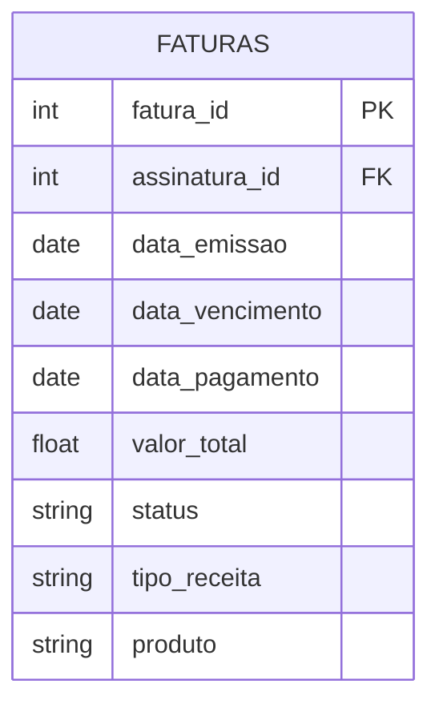
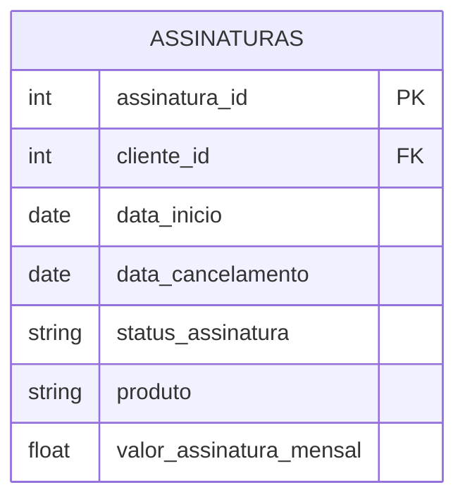
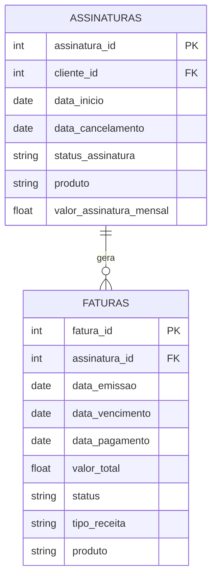

# Modelagem de tabealas

Para responder as perguntas listadas no enunciado ao menos duas tabelas seriam necessárias:

<b> 1 - Tabela faturas </b>
Tabela contendo informações sobre as faturas geradas, suas respectivas datas de emissão, de vencimento, de pagamento, valor total da fatura, status da fatura (aguardando_pagamento, pago, expirado, cancelada, etc), produto.




<b>2 - Tabela assinaturas</b>
Tabela contendo informações sobre as assinaturas dos clientes com suas respectivas datas de início, de cancelamento, valor da assinatura mensal, status da assinatura (ativa, cancelada, etc), produto associado.



<b>Relacionamento entre as tabelas:</b>



### Respondendo as perguntas com as tabelas

<b>Quantos reais tivemos em Faturas geradas em julho/2022 que estão aguardando o pagamento?</b>

```sql
SELECT 
    SUM(valor_total) AS total_aguardando
FROM 
    faturas
WHERE 
    DATE_TRUNC(data_emissao, MONTH) = '2022-07-01'
    AND status = 'aguardando_pagamento'
```